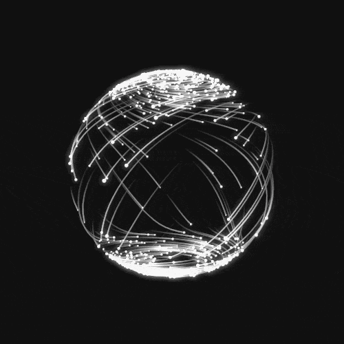

  

<h3 align="center">Franck Ferman</h3>

  Cybersecurity Engineer

  
  &nbsp;
  
  &nbsp;
  

  
    Pentest · Red Team · Malware Development 
    SOC · SIEM · DFIR · Cyber Threat Intelligence 
    Risk &amp; Compliance · ISMS · EBIOS RM · ISO 27001 · PCI-DSS · PDIS
  

  
  &nbsp;
  
  &nbsp;
  

  
    Windows · Linux · Hardening · Automation · DevOps 
    Local LLMs · RAG · Fine-tuning · AI Automation
  

  
  &nbsp;
  
  &nbsp;
  
  &nbsp;
  

---

### About me

Cybersecurity professional with a background spanning **Offensive Security**, **Defensive Security**, **System & Network Administration**, and **Security Governance** (Risk Management, Compliance, Security Strategy).

> I build and break things, and I document both.

---

### Education

- [HETIC](https://www.hetic.net/) — FullStack Web Development, Design & Communication
- [42](https://42.fr/) — Low-Level Programming, Algorithms
- [Aston Institute](https://aston-institut.com/) — System, Network & Security Administration
- [2600](https://www.2600.eu/) — Offensive & Defensive Security, Governance
- [Oteria Cyber School](https://www.oteria.fr/) — Cybersecurity & Governance

---

### Experience

- 💼 **Freelance / Auto-entrepreneur** — IT · Web Developer · SysAdmin · Security Consultant
  *Independent missions across IT, infrastructure, web development and security consulting.*

- 🌍 **[Veolia](https://www.veolia.com/)** — IT
  *Global leader in water, waste & energy management — €45B+ revenue, 220+ countries, 213,000+ employees.*

- 🇫🇷 **[French National Assembly](https://www.assemblee-nationale.fr/)** — IT
  *Core institution of French democracy — 577 deputies, Palais Bourbon, Paris.*

- 🏙 **[City of Aulnay-sous-Bois](https://www.aulnay-sous-bois.fr/)** — IT → SysAdmin & Network Engineer → CISO
  *Municipal infrastructure — 85,000+ inhabitants, 2,000+ agents, 100+ sites, 1,500+ endpoints, 100+ servers. On-prem datacenter (7+ physical hosts, server racks), 100+ L2/L3 switches over a city-wide fiber network linking sites across several kilometers — schools, police, administrative buildings. Everything managed in-house.*

- 🎭 **[Théâtre des Champs-Élysées](https://www.theatrechampselysees.fr/)** · **Groupe Caisse des Dépôts** — Cybersecurity Engineer
  *Classified French historical monument (1957), Avenue Montaigne — CDC-group property since 1970, via the Société Immobilière du Théâtre des Champs-Élysées (a CDC subsidiary). Hybrid SI security, offensive & defensive operations, SOC deployment.*

- 🏦 **[Crédit Agricole](https://www.credit-agricole.fr/)** · **CAGIP** (Crédit Agricole Group Infrastructure Platform) — Cybersecurity & Senior Linux Engineer — *IT infrastructure arm of one of the world's largest banking groups: €2,000B+ in assets, 150,000+ employees worldwide.*

- ⚔️ **KatanHack** — Founder
  *Cybersecurity consultancy — penetration testing, Active Directory & web audits, security awareness.*

> Additional engagements conducted as freelance / auto-entrepreneur — from quick one-off jobs and individual clients to small businesses and confidential contracts — across pentest, security consulting, IT infrastructure, and development.

---

### Research & CVEs

- **[CVE-2025-67906](https://nvd.nist.gov/vuln/detail/CVE-2025-67906)** — Stored XSS · MISP (Malware Information Sharing Platform) · Workflow Engine 
      
  *Zero-click persistent XSS via doT.js template injection. Session hijacking, threat intel data exfiltration.*

- **Critical 0-Days** — Blind SQLi & Zero-Click Stored XSS · GovTech / Enterprise SaaS 
    
  *Unauthenticated DB exfiltration + zero-click super-admin session takeover.*

- **Critical 0-Day** — Cryptographic Failure + Business Logic · Fortune 500 Payment Infrastructure 
    
  *Transaction integrity bypass across the entire global payment network.*

- **Critical** — Chained Authentication Bypass · Xelians 
   
  *Multiple chained vulnerabilities leading to full account takeover across the platform and all client tenants — including sensitive government archive data.*

- **High** — Mass Government Data Exfiltration via Authentication Bypass · DINUM (Direction Interministérielle du Numérique) 
   
  *Chained enumeration and authentication bypass — exposing criminal investigation files, classified government records, employee PII, and sensitive operational data across the entire French public sector.*

- **High** — CORS Misconfiguration + Regex Bypass · Qwant 
   
  *Cross-origin exfiltration of authenticated data via origin reflection and suffix bypass.*

- **High** — Healthcare Platform Data Exfiltration · Caisse Nationale d'Assurance Maladie 
   
  *Unauthenticated access to sensitive internal healthcare data and operational information of France's national health platform.*

- **Medium** — Customer PII Exposure via Reflected XSS · International Luxury Fashion House 
    
  *Reflected XSS in the storefront search enabling arbitrary JavaScript and the read/exfiltration of an authenticated customer's PII (identity, order history, addresses).*

> A curated, non-exhaustive selection — further findings remain private or under NDA.

---

  

- **Pentest & Red Teaming** — Infra., AD, Web, Wi-Fi Assessments, Adversary Emulation, OPSEC.
- **Malware Development** — Offensive tooling in C, Rust, Go, Python — loaders, rootkits, C2 implants, exploit writing.
- **Security Governance** — ISMS, risk management (EBIOS RM), compliance, awareness — CISO / Assistant CIO experience.
- **System & Network Administration** — AD, Cisco, Palo Alto, ESXi, Proxmox, Windows/Linux hardening, automation, DevOps.
- **Defensive Security** — SOC, detection engineering, incident response, threat hunting, SIEM.

*Available for engagements and serious collaborations — consulting or building.* 
*Availability varies with current assignments and workload; always up for a coffee.*

---

Skills & Competencies

 

**Languages & Scripting**

**Offensive Security**

**Reverse Engineering**

**Defensive Security**

**DevOps & Automation**

**Systems & Infrastructure**

**AI & LLM**

**Governance & Compliance**

---

### Contact

  
  &nbsp;
  
  &nbsp;
  

---

### Projects

#### Cybersecurity

- **[MetaDetective](https://github.com/franckferman/MetaDetective)** — Metadata intelligence for OSINT & pentesting — the Metagoofil successor.
- **[SYSTEMatic](https://github.com/franckferman/SYSTEMatic)** — Token impersonation: Administrator → SYSTEM, no tools required.
- **[ADMappingToolkit](https://github.com/franckferman/ADMappingToolkit)** — Active Directory inventory & network recon — reachability, ports, unconstrained delegation, EOS OS, CSV export.
- **[AD-AdminSDHolder-Toolkit](https://github.com/franckferman/AD-AdminSDHolder-Toolkit)** — Audit, detect backdoors & clean orphaned AdminSDHolder (AdminCount=1) accounts via well-known SIDs.
- **[PunyPwn](https://github.com/franckferman/PunyPwn)** — Typosquatting, IDN homograph & bitsquatting generator for red team & brand protection.
- **[red-merle](https://github.com/franckferman/red-merle)** — Reduce your cellular footprint.
- **[Memento-RTLO](https://github.com/franckferman/Memento-RTLO)** — Right-to-Left Override (RTLO) extension-spoofing file renamer.
- **[Floodles](https://github.com/franckferman/Floodles)** — Modular DoS/DDoS testing toolkit — 19 vectors across L3/L4/L7 (Python/C/Rust/Go).
- **[DOSArena](https://github.com/franckferman/DOSArena)** — DoS/DDoS training platform with live proof-of-impact scoring — 8 scenarios, 15 containers.
- **[GhostInTheKernel](https://github.com/franckferman/GhostInTheKernel)** — Stealthy modular LKM rootkit — kernel-level control, concealment & privilege escalation.
- **[0adC2](https://github.com/franckferman/0adC2)** — C2 framework tunneling encrypted traffic inside the 0 A.D. game protocol (ENet UDP).
- **[ping-007](https://github.com/franckferman/ping-007)** — Covert ICMP C2 in Go — AES-256-GCM exfil, OS ping mimicry, anti-SOC evasion.
- **[do-manager](https://github.com/franckferman/do-manager)** — Red Team infrastructure orchestration on DigitalOcean — one-command campaign deploy, C2/redirector/phishing firewall presets, IP rotation, node rebuild, and Havoc/Sliver/GoPhish/evilginx2 cloud-init templates. Go CLI + library.
- **[CrabMeleon](https://github.com/franckferman/CrabMeleon)** — Rust toolkit generating fully polymorphic binaries with sandbox detection & auto-signing.
- **[p0wnyShellX](https://github.com/franckferman/p0wnyShellX)** — Polymorphic-generation fork of p0wny-shell (single-file PHP webshell).
- **[KeyMaker](https://github.com/franckferman/KeyMaker)** — Code-signing certificate forgery — fake company, real signature.
- **[SATAN2](https://github.com/franckferman/SATAN2)** — Anti-forensics: multi-pass wiping, nested encryption, filesystem implosion & artifact forgery.
- **[hidemylogs](https://github.com/franckferman/hidemylogs)** — Surgical Linux log cleaner — erase lastlog/wtmp/btmp/utmp records while preserving file metadata.
- **[LastLog-Audit](https://github.com/franckferman/LastLog-Audit)** — Linux last-logon forensics from the binary lastlog database.
- **[DataDetective](https://github.com/franckferman/DataDetective)** — The Sleuth Kit (TSK) Python wrapper for digital forensic investigations.
- **[CassandraCTI](https://github.com/franckferman/CassandraCTI)** — Collect, process & auto-distribute Cyber Threat Intelligence from RSS across platforms.
- **[fr-cni-detector](https://github.com/franckferman/fr-cni-detector)** — Multithreaded OCR + parser to detect French national ID documents across file types.
- **[SecSheets](https://github.com/franckferman/SecSheets)** — Cybersecurity cheat-sheet hub — pentest, red/blue/purple team, GRC, tools & frameworks.
- **[CVE-2025-67906](https://github.com/franckferman/CVE-2025-67906)** — MISP ≤ 2.5.27 stored XSS via the Workflow Engine (doT.js template injection).
- **[CVE-2026-24061](https://github.com/franckferman/CVE-2026-24061)** — GNU InetUtils telnetd — unauthenticated remote root via NEW-ENVIRON injection.

#### Systems & Tooling

- **[ubuntu-post-install](https://github.com/franckferman/ubuntu-post-install)** — One script: hardening, GNOME tweaks, privacy & developer tooling on fresh Ubuntu.
- **[debian-server-post-install](https://github.com/franckferman/debian-server-post-install)** — Debian server post-install — profile-based config, VPS-safe hardening, firewall & Docker.
- **[Win-PostInstall](https://github.com/franckferman/Win-PostInstall)** — Windows post-install — automate, harden, customize.
- **[Hyper-V-Toolbox](https://github.com/franckferman/Hyper-V-Toolbox)** — Vagrant/Docker-style CLI to streamline Hyper-V virtual machine management.
- **[SysAdminToolbox](https://github.com/franckferman/SysAdminToolbox)** — Network administration toolkit — subnetting and a range of useful calculations.
- **[fix_wsl2_networking](https://github.com/franckferman/fix_wsl2_networking)** — Fix WSL2 networking and connectivity problems.
- **[PowerShell-Script-GUI-Template](https://github.com/franckferman/PowerShell-Script-GUI-Template)** — Build interactive Windows GUI apps in pure PowerShell — no C#/WPF.
- **[Interactive-Batch-Script-Template](https://github.com/franckferman/Interactive-Batch-Script-Template)** — Ready-to-use template for interactive batch scripts.
- **[bmctl](https://github.com/franckferman/bmctl)** — Firefox bookmark toolkit — audit duplicates, compare exports, merge, dashboard.
- **[whispr](https://github.com/franckferman/whispr)** — Whisper transcription pipeline — 3 backends, parallel chunks, multi-format output.

> **Beyond this profile** — a large part of my work never ships publicly: private tooling, projects built exclusively for clients, and internal research. What's here is only a fraction.

*Every tool built, every system broken, every vulnerability documented — the full picture lives in the [repositories](https://github.com/franckferman?tab=repositories).*

 

  

