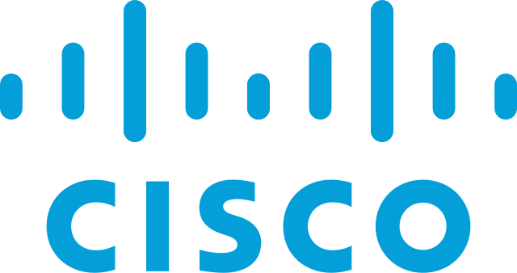

 
  

### About me 🔎:
With a wealth of diversified experience, I have demonstrated effective involvement in both the technical and governance spheres, broadening my spectrum of cross-disciplinary and specialist skills. This versatility has made me particularly sensitive to the multidimensional challenges of IT security.  

These companies trusted me: <a href="https://www.veolia.com/">Veolia</a> 🌍, the <a href="https://www.assemblee-nationale.fr/">French National Assembly</a> 🇫🇷 and the <a href="https://www.aulnay-sous-bois.fr/">city of Aulnay-sous-Bois</a> 🙠

- 🛡️ Previously served as a CISO (Chief Information Security Officer).
- 🚀 Currently a Self-entrepreneur. While I'm not seeking employment, I remain receptive to opportunities in the tech and cybersecurity fields.
- ☕ For collaborations or simply to connect over a chat or coffee, I'm open.
- ♂️ Pronouns: He/Him.

---

🛠 Development languages, tools and technologies mastered, used or being learned:

 
<code></code>
<code></code>
<code></code>
<code></code>
<code></code>
<code></code>
<code></code>
<code></code>
<code></code>
<code></code>
<code></code>
<code></code>
<code></code>
  
<code></code>
<code></code>
<code></code>
<code></code>
  
<code></code>
<code></code>
<code></code>
<code></code>
<code></code>
<code></code>
<code></code>
<code></code>
<code></code>
<code></code>
  
<code></code>
<code></code>
<code></code>
<code></code>
<code></code>
  
<code></code>
<code></code>
<code></code>

---

🤠Connect with me:
  
 

 

---

### Github Activity ✔:

  

### Some of my GitHub projects ✨:

  

### Show me your ❤️ by putting 🌟 to my [repositories](https://github.com/franckferman?tab=repositories).

